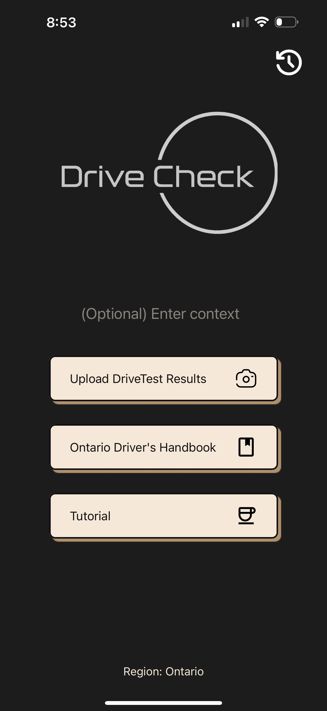
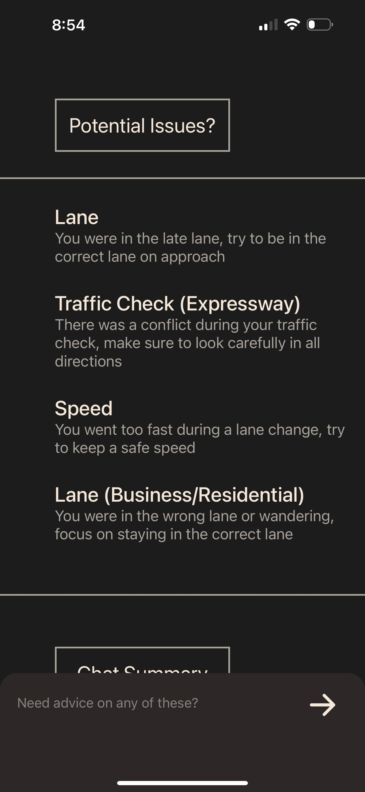
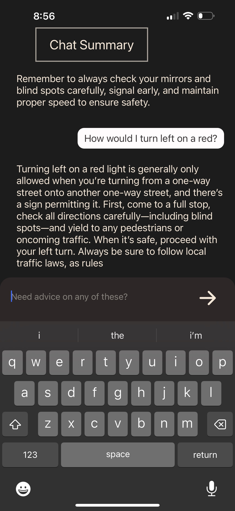

# Drive-Check

A mobile-first AI-powered tool that analyzes Ontario DriveTest score sheets and provides personalized driving advice — complete with visual issue icons and a chat assistant.


## 📸 Features

- Upload an Ontario DriveTest result page
- Automatically extract and summarize marked issues
- Ask follow-up questions in an AI-powered chat interface
- Personalized logs and issue-solving

---
<h2>📱 App Screens</h2>

  


---

## 🧑‍💻 Tech stack
Front End: React native (Optimized for IOS)  
Back End: Node.js  
AI: OpenAI  

## 🚀 Getting Started
### Prerequisites

- Node.js
- Yarn or npm
- Expo CLI (`npm install -g expo-cli`)
- OpenAI API key

---

### Backend Setup

```bash
cd backend-server
npm install
